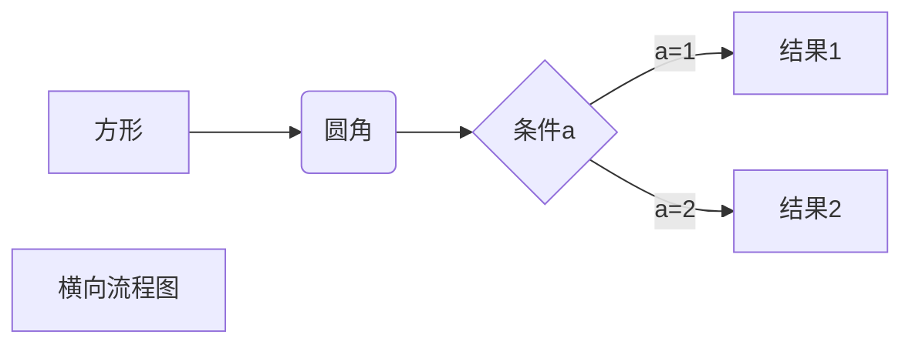
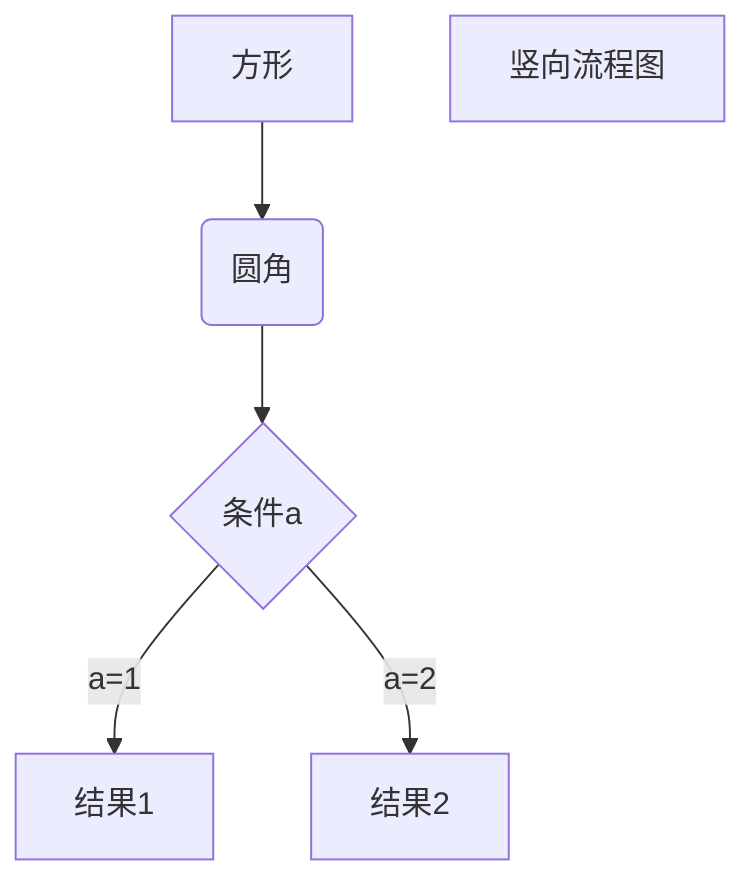
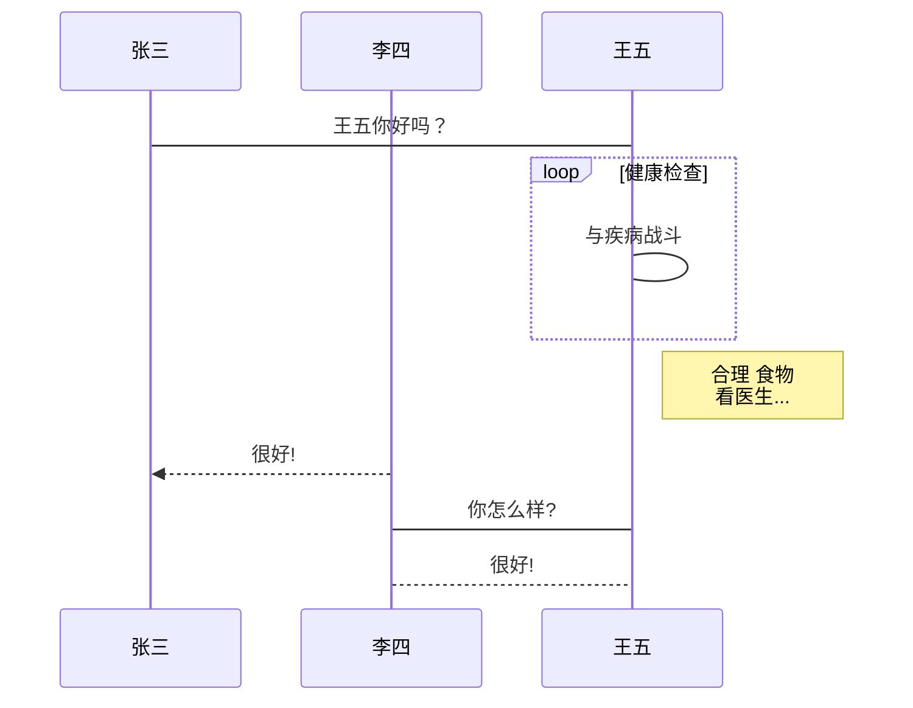
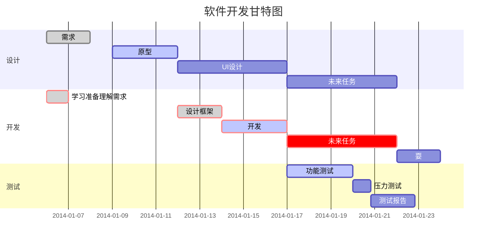

# Typora 学习指南

## 1、标题	

设置标题可以有两种格式：

**1、使用`#`标记**

通过`#`来表示，从#表示一级标题，##表示二级标题，以此类推，支持六级标题。

示例：

```
段落
# 一级标题
## 二级标题
### 三级标题
#### 四级标题
##### 五级标题
###### 六级标题
```

效果如下：

段落	<kbd>Ctrl</kbd> + <kbd>0</kbd>

# 一级标题	<kbd>Ctrl</kbd> + <kbd>1</kbd>

## 二级标题	<kbd>Ctrl</kbd> + <kbd>2</kbd>

### 三级标题	<kbd>Ctrl</kbd> + <kbd>3</kbd>

#### 四级标题	<kbd>Ctrl</kbd> + <kbd>4</kbd>

##### 五级标题	<kbd>Ctrl</kbd> + <kbd>5</kbd>

###### 六级标题	<kbd>Ctrl</kbd> + <kbd>6</kbd>


***若有快捷方式，将用具体快捷方式表示，后续不再说明***


**2、`=`和`-`标记一级和二级标题**

`=`和`-`的数量必须大于等于两个：

示例：

```
一级标题
======
二级标题
------
```

效果如下：

一级标题
======

二级标题
------


## 2、段落格式

### 2.1  段落

Markdown有两种换行格式：

**1、使用两个以上空格+回车**

示例：


**2、段落后面使用一个空行隔开**

示例：


***补充说明：在Typora直接按回车就可以换行，在源代码中是以第二种代码格式进行换行，采用第一个代码格式会显示和源代码模式中一样的格式。在传统的Markdown软件中需要以以上两种格式来换行，不然两行显示出来会出现在同一行。***

### 2.2 字体处理

示例：

```
*斜体*
_斜体_
**加粗**
__加粗__
***斜体加粗***
___斜体加粗___
<u>下划线</u>
~~删除线~~
==高亮==
^上标^
~下标~
<!--注释（导出pdf时不显示）-->
```

效果如下:

*斜体* 	<kbd>Ctrl</kbd>+<kbd>I</kbd>
_斜体_
**加粗**	<kbd>Ctrl</kbd>+<kbd>B</kbd>
__加粗__
***斜体加粗***	<kbd>Ctrl</kbd>+<kbd>I</kbd>;<kbd>Ctrl</kbd>+<kbd>B</kbd>
___斜体加粗___
<u>下划线</u>	<kbd>Ctrl</kbd>+<kbd>U</kbd>
~~删除线~~	<kbd>Alt</kbd>+<kbd>Shift</kbd>+<kbd>5</kbd> 
==高亮==
^上标^
~下标~

<!--注释（导出pdf时不显示）-->  

### 2.3  分割线

可以采用三个以上的`*`、`-`和`_`建立分隔线，行内不能存在其他字符，但是可以符号之间插入空格。

示例：

```
***
*****
* * *
---
___
```

效果如下：

***

*****
* * *
---
___

### 2.4  脚注

在文本中输入脚注，在后文中可以对脚注的内容进行解释，脚注的名称只能是唯一的。

示例：

```
这里是一长串文本[^脚注]
[^脚注]:这里是对脚注的解释
```

效果如下：

这里是一长串文本[^脚注]

[^脚注]:这里是对脚注的解释


## 3、列表

增加缩进	<kbd>Ctrl</kbd>+<kbd>]</kbd>

减少缩进	<kbd>Ctrl</kbd>+<kbd>[</kbd>

### 3.1 无序列表

无序列表可以采用`*`，`+`，`-`来标记，在符号后加空格，再输入内容。

示例：

```
* 第一项 
+ 第二项
- 第三项
```

效果如下：

* 第一项	<kbd>Ctrl</kbd>+<kbd>Shift</kbd>+<kbd>]</kbd>
* 第二项

- 第三项

***补充说明：Typora中无序列表按回车换行，下一行仍然按无序列表处理，可以再按回车取消；若要建立下一级子列表，则按Tab键***。

### 3.2 有序列表

有序列表采用数字加`.`标记，在符号后加空格，再输入内容。

示例：

```
1. 第一项
2. 第二项
3. 第三项
```

效果如下：

1. 第一项	<kbd>Ctrl</kbd>+<kbd>Shift</kbd>+<kbd>[</kbd>
2. 第二项
3. 第三项

***补充说明：Typora中有序列表按回车换行，下一行仍然按有序列表处理，可以再按回车取消；若要建立下一级子列表，则按Tab键。***

### 3.3 列表嵌套

列表嵌套需要在子列表前加四个空格。**（在非严格模式下，不一定需要四个空格）**

示例：

```
1. 第一项：
  	- 第一项嵌套的第一个元素
    - 第一项嵌套的第二个元素
2. 第二项：
    - 第二项嵌套的第一个元素
    - 第二项嵌套的第二个元素
```

1. 第一项：
    - 第一项嵌套的第一个元素
    - 第一项嵌套的第二个元素
2. 第二项：
    - 第二项嵌套的第一个元素
    - 第二项嵌套的第二个元素

### 3.4 任务列表

任务列表是能对制定的任务按照完成与否进行勾选的列表，有三种代码格式。可以对任务用鼠标进行勾选，代码中用`x`表示勾选状态。

示例：

```
* [ ] 今天的任务
+ [ ] 今天的任务
- [ ] 今天的任务
* [x] 今天的任务
```

效果如下：

* [ ] 今天的任务

+ [ ] 今天的任务

- [ ] 今天的任务

* [x] 今天的任务


## 4、区块引用

### 4.1 引用与嵌套引用

区块引用是在段落开头采用`>`符号。另外引用也可以嵌套。

示例：

```
>引用
>>再引用
>>>再再引用
```

效果如下:

>引用 <kbd>Ctrl</kbd>+<kbd>Shift</kbd>+<kbd>Q</kbd>
>>再引用
>>
>>>再再引用


### 4.2 区块中使用列表

示例：

```
>区块中使用列表
>1. 第一项
>* 无序项
```

效果如下：

>区块中使用列表
>1. 第一项
>
>* 无序项

### 4.3 列表中使用区块

在列表中使用区块，需要在`>`前添加四个空格的缩进。

示例：

```
1. 第一项
    >引用
2. 第二项
```

1. 第一项
   
    >引用
2. 第二项


## 5、代码

### 5.1 段内代码		<kbd>Ctrl</kbd> + <kbd>Shift</kbd> + <kbd>`</kbd>

段落内的片段代码可以用反引号`` `来包裹。

示例：

```
`printf`函数
```

效果如下：

`printf`函数

### 5.2 代码区块	<kbd>Ctrl</kbd> + <kbd>Shift</kbd> + <kbd>K</kbd>

代码区块有两种代码格式。

**1、代码区块前用4个空格或者一个制表符(Tab键)**

举例：

```
	def main():
		print('Hello world!')
```
效果如下：

	def main():
		print('Hello world!')
***补充说明：在Typora中直接输入4个空格或按下Tab，Typora会默认以为输入的文本，并不会生成代码区块，但是可以进入源代码模式进行输入，就会识别为代码区块。***

**2、用` ``` ` 包裹一段代码，在第一个` ``` `后可以指定一种语言，也可以不指定（不是所有Markdown编辑器都支持指定语言，比如MarkdownPad2)**

举例：

```
​```python
def main():
	print('Hello world!')
​```
```

效果如下：

```python
def main():
	print('Hello world!')
```

## 6、链接

### 6.1 为链接指定名称	<kbd>Ctrl</kbd>+<kbd>K</kbd>

 Markdown中既可以输入网页链接也可以输入本地链接，采用的格式如下：

```
[链接名称](链接地址 “链接标题”)
```

其中链接标题选填，如果填写链接标题，当鼠标移动到链接上则会出现标题。

举例：

```
我想上[哔哩哔哩](https://www.bilibili.com/ '大型同性交友网站')
我想找到[C盘中的Windows文件夹](C:\Windows)
```

效果如下：

我想上[哔哩哔哩](https://www.bilibili.com/ '大型同性交友网站')
我想找到[C盘中的Windows文件夹](C:\Windows)

### 6.2 直接使用链接

Markdown中也可以直接输入地址，使用方法是用`< >`将链接包裹起来。(在Typora中也可以直接输入链接)

举例：

```
B站的网站是<https://www.bilibili.com/>
B站的网站是https://www.bilibili.com/
```

效果如下：

B站的网站是<https://www.bilibili.com/> 

B站的网站是https://www.bilibili.com/

***补充说明，Typora中插入链接会自动识别为超链接***

### 6.3 设置变量插入链接

Markdown也支持通过变量来设置链接，变量的赋值可以在文档末尾进行，采用格式如下：

```
[链接名称][变量]
[变量]: 链接地址 “链接标题”
```

举例：

```
我想上[哔哩哔哩][b站]
我想找到[C盘中的Windows文件夹][windows]

[b站]: https://www.bilibili.com/ "大型同性交友网站"
[windows]: C:\Windows
```

效果如下：

我想上[哔哩哔哩][b站]
我想找到[C盘中的Windows文件夹][windows]

[b站]: https://www.bilibili.com/  "大型同性交友网站"
[windows]: C:\Windows


***补充说明，不太建议使用在Typora中设置变量再插入链接，链接标题会显示不出来，而在MarkdownPad2里就能正常显示。***

### 6.4 为本Markdown文本内的标题设置链接

Markdown中可以为标题设置连接，采用如下格式：

```
[链接名称](#标题名称 “链接标题”)
```

举例：

```
[6、链接](#6、链接 "链接说明")
```

效果如下：

[6、链接](#6、链接 "链接说明")

或使用变量来插入标题链接

```
[6、链接][1]
[1]: #6、链接 "链接说明"
```

[6、链接][1]

[1]: #6、链接 "链接说明"

## 7、图片

Markdown中插入图片的方法类似插入链接。

### 7.1 一般插入图片	<kbd>Ctrl</kbd>+<kbd>Shift</kbd>+<kbd>I</kbd>

图片地址既可以插入网页图片地址也可以插入本地图片地址，图片语法格式如下：

```

```

同样图片的标题也是选填的。

***补充说明：在图片无法显示时，alt文本规定了在图像无法显示时的替代文本。***

举例：

```


```

效果如下：


### 7.2 设置变量插入图片

Markdown也支持通过变量来设置图片地址，变量的赋值可以在文档末尾进行，采用格式如下：

```
![链接名称][变量]
[变量]: 图片地址 “图片标题”
```

举例：

```
![B站图片][b站]

![Windows壁纸][壁纸]

[b站]: https://timgsa.baidu.com/timg?image&quality=80&size=b9999_10000&sec=1596194866005&di=7a8c162c44db81ff2f56d8771c229905&imgtype=0&src=http%3A%2F%2Fupload.chinamac.com%2F2015%2F0108%2F20150108103418386.png 
[壁纸]: C:\Windows\Web\Wallpaper\Windows\img0.jpg
```

效果如下：

![B站图片][b站]

![Windows壁纸][壁纸]

[b站]:  https://timgsa.baidu.com/timg?image&quality=80&size=b9999_10000&sec=1596194866005&di=7a8c162c44db81ff2f56d8771c229905&imgtype=0&src=http%3A%2F%2Fupload.chinamac.com%2F2015%2F0108%2F20150108103418386.png "大型同性交友网站"
[壁纸]: C:\Windows\Web\Wallpaper\Windows\img0.jpg	"windows图片"

***补充说明，不太建议使用在Typora中设置变量再插入图片，图片标题会显示不出来，而且插入网页图片也不能显示，而在MarkdownPad2里就能正常显示。***

## 8、表格	<kbd>Ctrl</kbd>+<kbd>T</kbd>

Markdown的表格可以通过输入语法来制作，`|`来分隔单元格，使用`-`来分隔表头和其他行。其中`-`的数量对表格的样式不会产生影响。

举例：

```
|表头|表头|
|---|-|
|单元格|单元格|
|单元格|单元格|
```

效果如下：

| 表头   | 表头   |
| ------ | ------ |
| 单元格 | 单元格 |
| 单元格 | 单元格 |

还可以通过语法设置表格的对齐方式：

- `:-`左对齐
- `:-:`居中对齐
- `-:`右对齐

举例：

```
|左对齐|居中对齐|右对齐|
|:-----|:----:|----:|
|单元格 |单元格|单元格|
|单元格 |单元格|单元格|
```

效果如下：

| 左对齐 | 居中对齐 | 右对齐 |
| :----- | :------: | -----: |
| 单元格 |  单元格  | 单元格 |
| 单元格 |  单元格  | 单元格 |

## 9、公式

Typora支持插入Tex或LaTex格式的数学公式，包括mhchem，BBOX，AMSmath。

提交后加载Mathjax对数学公式进行渲染（但是不是所有Markdown编辑器都支持的，比如MarkdownPad2就不支持）。

### 9.1 内联公式

在段内插入内联公式，可以通过美元符号`$`包裹Tex或LaTex格式的数学公式实现。

举例：

```
勾股定理：${{a}^{2}}+{{b}^{2}}\text{=}{{c}^{2}}$
```

效果如下：

勾股定理：${{a}^{2}}+{{b}^{2}}\text{=}{{c}^{2}}$

### 9.2 公式区块	<kbd>Ctrl</kbd>+<kbd>Shift</kbd>+<kbd>M</kbd>

公式区块可以用两个美元符号`$$`包裹Tex或LaTex格式的数学公式实现。

举例：

```
$$
\sqrt{{{a}^{2}}+{{b}^{2}}}
$$
```

效果如下：
$$
\sqrt{{{a}^{2}}+{{b}^{2}}}
$$

## 10、高级功能

### 10.1 绘图

Typora支持以代码绘制流程图、时序图和甘特图。

建立代码区块，在```` `后选择代码的解释方式，在代码区块中输入代码，就可以绘制出流程图、时序图和甘特图。

以下介绍几种实例：

**1. 横向流程图**

```
​```mermaid
graph LR
A[方形] -->B(圆角)
    B --> C{条件a}
    C -->|a=1| D[结果1]
    C -->|a=2| E[结果2]
    F[横向流程图]
​```
```



**2. 竖向流程图**

```
​```mermaid
graph TD
A[方形] --> B(圆角)
    B --> C{条件a}
    C --> |a=1| D[结果1]
    C --> |a=2| E[结果2]
    F[竖向流程图]
​```
```



**3. 标准流程图（竖向）**

```
​```flow
st=>start: 开始框
op=>operation: 处理框
cond=>condition: 判断框(是或否?)
sub1=>subroutine: 子流程
io=>inputoutput: 输入输出框
e=>end: 结束框
st->op->cond
cond(yes)->io->e
cond(no)->sub1(right)->op
​```
```

```flow
st=>start: 开始框
op=>operation: 处理框
cond=>condition: 判断框(是或否?)
sub1=>subroutine: 子流程
io=>inputoutput: 输入输出框
e=>end: 结束框
st->op->cond
cond(yes)->io->e
cond(no)->sub1(right)->op
```

**4 .标准流程图（横向）**

```
​```flow
st=>start: 开始框
op=>operation: 处理框
cond=>condition: 判断框(是或否?)
sub1=>subroutine: 子流程
io=>inputoutput: 输入输出框
e=>end: 结束框
st(right)->op(right)->cond
cond(yes)->io(bottom)->e
cond(no)->sub1(right)->op
​```
```

```flow
st=>start: 开始框
op=>operation: 处理框
cond=>condition: 判断框(是或否?)
sub1=>subroutine: 子流程
io=>inputoutput: 输入输出框
e=>end: 结束框
st(right)->op(right)->cond
cond(yes)->io(bottom)->e
cond(no)->sub1(right)->op
```

**5 .UML时序图**

```
​```sequence
对象A->对象B: 对象B你好吗?（请求）
Note right of 对象B: 对象B的描述
Note left of 对象A: 对象A的描述(提示)
对象B-->对象A: 我很好(响应)
对象A->对象B: 你真的好吗？
​```
```

```sequence
对象A->对象B: 对象B你好吗?（请求）
Note right of 对象B: 对象B的描述
Note left of 对象A: 对象A的描述(提示)
对象B-->对象A: 我很好(响应)
对象A->对象B: 你真的好吗？
```

**6 .UML时序图（复杂）**

```
​```sequence
Title: 标题：复杂使用
对象A->对象B: 对象B你好吗?（请求）
Note right of 对象B: 对象B的描述
Note left of 对象A: 对象A的描述(提示)
对象B-->对象A: 我很好(响应)
对象B->小三: 你好吗
小三-->>对象A: 对象B找我了
对象A->对象B: 你真的好吗？
Note over 小三,对象B: 我们是朋友
participant C
Note right of C: 没人陪我玩
​```
```

```sequence
Title: 标题：复杂使用
对象A->对象B: 对象B你好吗?（请求）
Note right of 对象B: 对象B的描述
Note left of 对象A: 对象A的描述(提示)
对象B-->对象A: 我很好(响应)
对象B->小三: 你好吗
小三-->>对象A: 对象B找我了
对象A->对象B: 你真的好吗？
Note over 小三,对象B: 我们是朋友
participant C
Note right of C: 没人陪我玩
```

**7 .UML标准时序图**

```
​```mermaid
%% 时序图例子,-> 直线，-->虚线，->>实线箭头
  sequenceDiagram
    participant 张三
    participant 李四
    张三->王五: 王五你好吗？
    loop 健康检查
        王五->王五: 与疾病战斗
    end
    Note right of 王五: 合理 食物 <br/>看医生...
    李四-->>张三: 很好!
    王五->李四: 你怎么样?
    李四-->王五: 很好!
​```
```



**8.甘特图**

```
​```mermaid
%% 语法示例
        gantt
        dateFormat  YYYY-MM-DD
        title 软件开发甘特图
        section 设计
        需求                      :done,    des1, 2014-01-06,2014-01-08
        原型                      :active,  des2, 2014-01-09, 3d
        UI设计                     :         des3, after des2, 5d
    未来任务                     :         des4, after des3, 5d
        section 开发
        学习准备理解需求                      :crit, done, 2014-01-06,24h
        设计框架                             :crit, done, after des2, 2d
        开发                                 :crit, active, 3d
        未来任务                              :crit, 5d
        耍                                   :2d
        section 测试
        功能测试                              :active, a1, after des3, 3d
        压力测试                               :after a1  , 20h
        测试报告                               : 48h
​```
```



### 10.2 HTML(目前还没有学HTML)

不在 Markdown 涵盖范围之内的标签，都可以直接在文档里面用 HTML 撰写。

目前支持的 HTML 元素有：`<kbd> <b> <i> <em> <sup> <sub> <br>`等 ，如：

举例：

```
使用 <kbd>Ctrl</kbd>+<kbd>Alt</kbd>+<kbd>Del</kbd> 重启电脑
```

效果如下：

使用 <kbd>Ctrl</kbd>+<kbd>Alt</kbd>+<kbd>Del</kbd> 重启电脑

### 10.3 转义

Markdown 使用了很多特殊符号来表示特定的意义，如果需要显示特定的符号则需要使用转义字符，Markdown 使用反斜杠转义特殊字符。

举例：

```
**文本加粗** 
\*\* 正常显示星号 \*\*
```

效果如下：

**文本加粗** 
\*\* 正常显示星号 \*\*

Markdown 支持以下这些符号前面加上反斜杠来帮助插入普通的符号：

```
\   反斜线
`   反引号
*   星号
_   下划线
{}  花括号
[]  方括号
()  小括号
#   井字号
+   加号
-   减号
.   英文句点
!   感叹号
```

### 10.4 emoji

通过输入冒号`:`+特定emoji描述可以生成emoji表情。

举例：

```
:laughing:死:man:了
```

效果如下：
:laughing:死:man:了

### 10.5 生成目录

输入`[toc]`可以自动生成目录。

效果如下：

[toc]


**参考资料：**

<https://www.runoob.com/markdown/md-tutorial.html>
